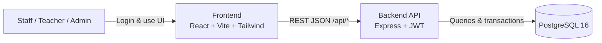
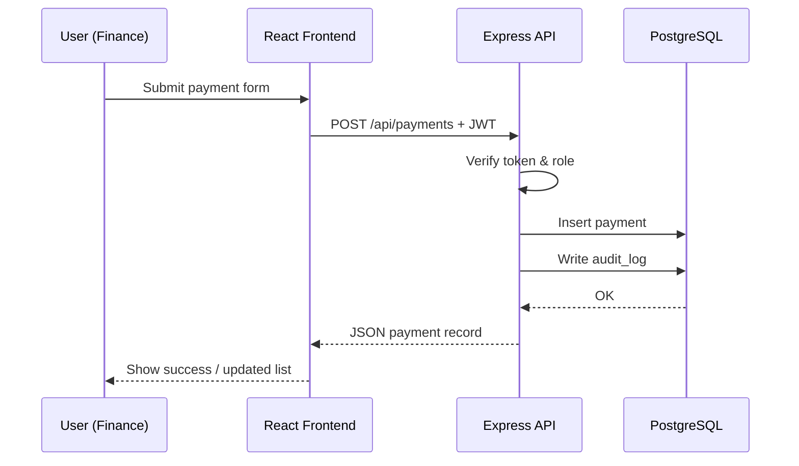

# Smile International School Management System  
## Technical Presentation Overview

**Document purpose:** Describe the whole system (frontend, backend, API, database, security, and deployment) for school presentations, demos, and stakeholder reviews.

**Related doc:** Day-to-day usage instructions are in [`USER_GUIDE.md`](./USER_GUIDE.md).

---

## 1. What this system is

**Smile International School Management System** is a web-based **School Admin Portal** that helps the school run daily operations in one place:

| Area | What it covers |
|------|----------------|
| **Students** | Registration, classes, attendance, deadlines, tuition payments, books, graduation / alumni |
| **Stock / Shop** | Categories, products, point of sale (POS), inventory reports |
| **Finance** | Tuition, POS revenue, pending invoices, cash flow, payment methods, monthly summary, profit & loss, salary, school expenses, student ledger |
| **Administration** | Teachers, staff, user accounts, audit log |

It is designed for **Cambodia school operations** (calendar/timezone `Asia/Phnom_Penh`) and supports **English + Khmer** in the interface.

---

## 2. System architecture (big picture)

The product is a **3-tier web application**:

```text
┌─────────────────────┐     HTTPS / HTTP      ┌─────────────────────┐
│   Web Browser       │ ◄──────────────────►  │  Web (Nginx)        │
│   (Phone / Laptop)  │                       │  Serves React SPA   │
└─────────────────────┘                       └──────────┬──────────┘
                                                         │ /api/*
                                                         ▼
                                              ┌─────────────────────┐
                                              │  API (Express)      │
                                              │  JWT + role checks  │
                                              └──────────┬──────────┘
                                                         │ SQL
                                                         ▼
                                              ┌─────────────────────┐
                                              │  PostgreSQL DB      │
                                              └─────────────────────┘
```

### Architecture diagram



### Tech stack summary

| Layer | Technology |
|-------|------------|
| **Frontend** | React 19, Vite 7, React Router 6, Tailwind CSS 4 |
| **Backend** | Node.js, Express 5 |
| **Auth** | JWT (JSON Web Token), bcrypt password hashing |
| **Database** | PostgreSQL 16 |
| **Deploy** | Docker Compose, Nginx reverse proxy |
| **Languages (UI)** | English + Khmer (custom i18n) |

**One-line pitch:**  
*A modern React portal talking to a secure Express API, storing school data in PostgreSQL, ready to run locally or on a server with Docker.*

---

## 3. Frontend (what users see)

### 3.1 Role of the frontend

The frontend is a **Single Page Application (SPA)**. After login, staff stay on one website and navigate between pages without full page reloads. The UI:

- Shows only menus allowed for the user’s **role**
- Calls the backend API for all data (students, payments, reports, etc.)
- Supports **light / dark** theme and **EN / ខ្មែរ** language
- Works on **desktop and mobile** (responsive layout with a slide-out menu on phones)

### 3.2 Main folders

| Path | Purpose |
|------|---------|
| `src/pages/` | Screens (Dashboard, Students, Stock, Finance, Admin, Login) |
| `src/components/` | Shared UI (Header, Sidebar, Search, tables, buttons) |
| `src/context/` | Global state: Auth, Theme, Language |
| `src/i18n/` | English (`en.js`) and Khmer (`km.js`) text |
| `src/lib/` | API client, roles, exports, school brand |
| `src/layouts/` | Dashboard shell (sidebar + header + content) |

### 3.3 How pages are protected

1. **Login required** — `ProtectedRoute` blocks the app until a valid session exists.
2. **Role required** — `RoleRoute` + `src/lib/roles.js` allow or deny each path.
3. **Sidebar** — Built from the same role rules, so users do not see forbidden modules.

### 3.4 Important frontend features for demos

- **Global search** — Find pages, students, products, classes quickly.
- **Dashboard stats** — Live counts from the API.
- **Data tables & forms** — Register students, record payments, run POS, filter finance reports.
- **Export helpers** — Finance/report CSV-style exports where enabled.
- **Idle logout (5 minutes)** — Improves security on shared office computers.
- **Mobile-ready** — Safe areas and drawer navigation suitable for phones (e.g. large iPhones).

### 3.5 Development proxy

In local development, Vite proxies `/api` requests to the API server (default `http://127.0.0.1:4000`), so the browser can use relative URLs like `/api/students` without CORS pain during coding.

---

## 4. Backend (server / business logic)

### 4.1 Role of the backend

The backend is the **brain of the system**. The UI never talks to the database directly. All create/read/update/delete operations go through the API, which:

- Verifies the user token
- Checks the user’s role
- Applies school business rules (e.g. teacher only sees assigned classes)
- Writes **audit logs** for important actions
- Keeps data consistent (e.g. POS checkout reduces stock)

### 4.2 Main folders / files

| Path | Purpose |
|------|---------|
| `server/index.js` | Express app entry — mounts routes, auth, CORS |
| `server/db.js` | PostgreSQL connection pool, startup migrations/seed |
| `server/schema.sql` | Base database tables |
| `server/auth.js` | Login helpers, JWT sign/verify, password hashing |
| `server/middleware/auth.js` | `requireAuth`, `requireRole` |
| `server/finance.js` | Finance overview / aggregations |
| `server/salaryPayments.js` | Staff & teacher salary payments |
| `server/schoolExpenses.js` | Operating expenses |
| `server/classAttendance.js` | Attendance sheets |
| `server/userClasses.js` | Teacher ↔ class assignments |
| `server/auditLog.js` | Activity logging |
| `server/users.js` | User accounts and people directories |

### 4.3 Roles enforced on the server

| Role | Code value | Typical powers |
|------|------------|----------------|
| Admin | `admin` | Full access + users + audit log |
| School Admin | `school_admin` | Operations; limited payment edit rights |
| Finance | `finance` | Payments, stock sales, finance reports, salary/expenses |
| Teacher | `teacher` | Students/classes/attendance scoped to assigned classes |

**Important:** Frontend hiding a button is not enough. The API also rejects unauthorized requests.

---

## 5. API (how frontend and backend talk)

### 5.1 Style

- **REST-style HTTP API**
- **JSON** request and response bodies
- Base path: `/api/...`
- Auth header: `Authorization: Bearer <token>`

### 5.2 Auth & health

| Method | Endpoint | Purpose |
|--------|----------|---------|
| `GET` | `/api/health` | Server health check (public) |
| `POST` | `/api/auth/login` | Email + password → JWT + user profile |
| `GET` | `/api/auth/me` | Restore session from token |

Default token lifetime: **8 hours** (configurable via `JWT_EXPIRES_IN`).

### 5.3 Domain API groups (overview)

**Students & classes**

- Student CRUD and next student ID
- Classes, enrollments, class roster
- Class teachers assignment
- Attendance get/update + summary
- Deadlines, book issues, alumni

**Payments & invoices**

- Payment records (tuition and related fees)
- Next invoice ID helper

**Stock & POS**

- Categories, products, orders
- `POST /api/pos/checkout` — complete a sale and update stock
- Stock report endpoints (summary, sales over time, top products, low stock)

**Finance**

- `/api/finance/overview`
- Salary roster & salary payments
- School expenses
- Supporting data for cash flow, P&L, ledgers (built from payments, POS, salary, expenses)

**Administration**

- Users (admin)
- Teachers / staff people records
- Audit logs (admin)
- Dashboard stats

**Generic collection pattern**  
Many resources use consistent routes such as:

- `GET /api/{collection}`
- `POST /api/{collection}`
- `GET|PUT|DELETE /api/{collection}/{id}`

Examples of collections: `students`, `classes`, `payments`, `products`, `orders`, `categories`, `deadlines`, `bookIssues`, `alumni`, `programs`.

### 5.4 Request flow (example: record a payment)



---

## 6. Database

### 6.1 Engine

- **PostgreSQL 16** (Docker image `postgres:16-alpine` in local/prod compose)
- Default database name: `management_school`
- Local host port (dev): **5433** → container `5432`
- App connects with `DATABASE_URL` using the `pg` driver

### 6.2 Schema approach

1. **Base schema** — `server/schema.sql` creates tables when the database is first initialized.
2. **Runtime migrations** — On API startup, `server/db.js` applies safe upgrades (`ALTER TABLE ... IF NOT EXISTS`, data fixes).
3. **Seed data** — If empty, the system can seed demo programs/categories/products and starter users.

### 6.3 Main tables (business data)

| Table | Stores |
|-------|--------|
| `students` | Student profiles and program info |
| `classes` | Class definitions |
| `class_students` | Who is enrolled in which class |
| `class_attendance` | Daily attendance by class |
| `deadlines` | Student deadlines / tasks |
| `payments` | Tuition and fee invoices / payments |
| `book_issues` | Book borrow / return records |
| `alumni` | Graduated / finished students |
| `categories` | Product categories |
| `programs` | Study programs |
| `products` | Shop products and stock |
| `orders` / `order_items` | POS sales |
| `users` | Login accounts and roles |
| `user_classes` | Teacher assigned to classes |
| `salary_payments` | Payroll payouts |
| `school_expenses` | Operating expenses |
| `audit_logs` | Who changed what, when, from which IP |

### 6.4 Why PostgreSQL fits a school system

- Reliable relational data (students ↔ classes ↔ payments)
- Strong consistency for money and stock updates
- Easy backup and reporting with SQL / tools such as DBeaver
- Works the same in Docker local and cloud RDS-style hosting

---

## 7. Security & compliance features

| Feature | Benefit for the school |
|---------|------------------------|
| **Password hashing (bcrypt)** | Passwords are not stored in plain text |
| **JWT sessions** | Secure login tokens for API access |
| **Role-based access (RBAC)** | Teachers/finance/office see only what they need |
| **Teacher class scoping** | Teachers cannot freely browse unrelated classes |
| **Audit log** | Trace important create/update/login actions |
| **Idle logout (5 min)** | Reduces risk on shared office PCs |
| **Trusted proxy support** | Correct client IP behind Nginx / Cloudflare |
| **DB port binding** | Local compose can keep Postgres on localhost only |

**Presentation talking point:**  
*Sensitive school and finance data never sits only in the browser — the server decides who can read or write.*

---

## 8. Deployment & environments

### 8.1 Local development (typical)

```bash
npm run db:up      # PostgreSQL container
npm run dev:api    # API on port 4000
npm run dev        # Frontend on port 5173
```

Configure secrets and connection strings from `.env.example` → `.env`.

### 8.2 Docker production-style stack

Services commonly used:

| Service | Role |
|---------|------|
| `web` | Nginx serves the built React app and proxies `/api` |
| `api` | Node/Express backend |
| `db` | PostgreSQL (or external RDS via `docker-compose.rds.yml`) |

Useful commands:

- `npm run docker:up` — start stack and print URLs  
- `npm run deploy` / `npm run deploy:rds` — deployment helpers  

### 8.3 Environment variables (high level)

| Variable | Meaning |
|----------|---------|
| `DATABASE_URL` | Postgres connection string |
| `JWT_SECRET` | Secret used to sign login tokens |
| `PORT` / `HOST` | API listen address |
| `WEB_PORT` / `PUBLIC_URL` | Public website port and URL |
| `VITE_API_PROXY` | Dev-only proxy target for `/api` |

---

## 9. Functional modules (what to show in a school presentation)

### A. Student lifecycle

Register → assign to class → take attendance → track deadlines → collect fees → issue books → graduate / alumni.

### B. Classroom operations

Class management, teacher assignment, conflict-aware scheduling checks, attendance sheets.

### C. School shop (Stock + POS)

Maintain inventory, sell items at the counter, print/view invoices, monitor low stock and sales reports.

### D. Finance office

- Collect tuition and other fees (Cash / Card / QR)
- See pending invoices and student ledgers
- Track POS revenue
- Pay staff/teacher salaries
- Record school expenses
- Review **daily cash flow** and **profit & loss** (cash-based)

### E. Administration & accountability

- Manage teacher and staff HR profiles
- Create user logins and assign roles
- Review **audit log** for accountability

### F. Inclusive UX

- Bilingual **English / Khmer**
- Light and dark themes
- Responsive layout for office PCs and phones

---

## 10. Suggested presentation flow (10–15 minutes)

1. **Problem** — Schools juggle students, fees, stock, and reports in separate tools/spreadsheets.  
2. **Solution** — One portal with role-based access for Admin, Office, Finance, and Teachers.  
3. **Live demo**
   - Login as Finance → Pending Payments → record a payment  
   - Open POS → complete a sale  
   - Show Profit & Loss / Cash Flow  
   - Switch language to Khmer  
   - Login as Teacher → attendance for assigned class  
   - Login as Admin → User Management + Audit Log  
4. **Architecture slide** — Browser → Nginx/React → Express API → PostgreSQL  
5. **Security** — JWT, roles, audit, idle logout  
6. **How we run it** — Docker compose / local npm scripts  
7. **Next steps** — Real user accounts, stronger secrets, school-specific branding/training  

---

## 11. Project map (for technical audience)

```text
Management-school/
├── src/                 # Frontend (React SPA)
├── server/              # Backend API + SQL schema
├── public/              # Static assets (logo, etc.)
├── scripts/             # Deploy & helper scripts
├── docker-compose*.yml  # Local / prod / RDS stacks
├── nginx.conf           # SPA + /api reverse proxy
├── USER_GUIDE.md        # How staff use the system
└── SYSTEM_PRESENTATION.md  # This document
```

---

## 12. Closing statement (optional slide text)

> Smile International School Management System is a full-stack school platform: a bilingual, mobile-friendly React frontend; a secure Express REST API with role-based permissions and audit logging; and a PostgreSQL database for students, classes, stock, and finance — deployable with Docker for reliable school operations.

---

*Prepared for school presentation and technical walkthrough. For end-user steps, see `USER_GUIDE.md`.*
